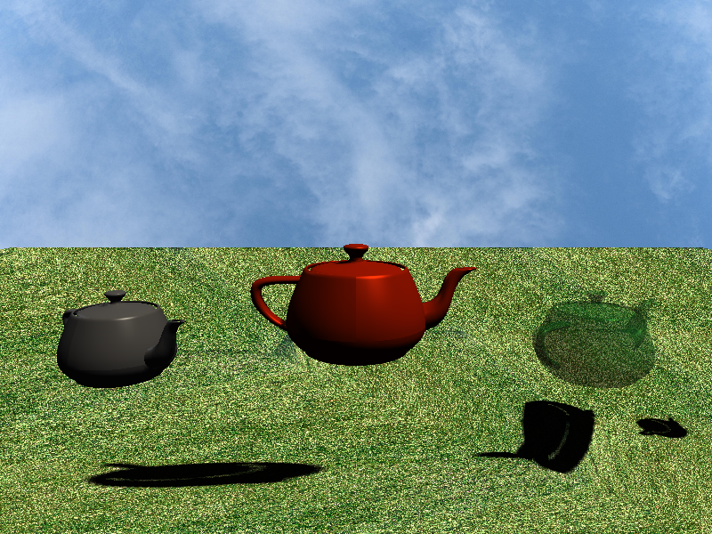

# Software Rasterizer

A complete 3D graphics rendering pipeline implemented from scratch in C++. This software rasterizer implements all core stages of graphics processing without relying on GPU acceleration or graphics APIs like OpenGL/DirectX.



## Features

### Rendering Pipeline

- **Complete 3D Pipeline**: Model → Vertex Processing → Clipping → Rasterization → Fragment Processing → Framebuffer
- **Perspective Projection**: Configurable FOV, aspect ratio, and near/far planes
- **Frustum Clipping**: Sutherland-Hodgman algorithm for all 6 frustum planes
- **Triangle Rasterization**: Edge function-based scan conversion with barycentric interpolation
- **Depth Testing**: Z-buffer based occlusion handling

### Lighting & Shading

- **Blinn-Phong Lighting Model**: Ambient, diffuse, and specular components
- **Multiple Light Types**: Directional, point, and spot lights with attenuation
- **Shadow Mapping**: Real-time shadows with PCF (Percentage Closer Filtering)
- **Material System**: Configurable ambient, diffuse, specular properties and shininess

### Texturing

- **Texture Mapping**: Diffuse and specular texture support
- **Filtering Modes**: Nearest-neighbor and bilinear interpolation
- **Wrap Modes**: Repeat, clamp-to-edge, and mirrored repeat
- **Multiple Format Support**: JPG, PNG via stb_image

### Advanced Features

- **Alpha Blending**: Standard, additive, and multiply blend modes
- **Backface Culling**: Performance optimization
- **Parallel Rendering**: Multi-threaded triangle rasterization
- **Wireframe Mode**: Debug visualization
- **OBJ Model Loading**: Full mesh import with flat/smooth normal computation

## Project Structure

```
software-rasterizer/
├── include/
│   ├── math/               # Vector and matrix mathematics
│   ├── pipeline/           # Rendering pipeline stages
│   ├── camera.h           # Camera and projection
│   ├── framebuffer.h      # Color and depth buffers
│   ├── scene.h            # Scene graph management
│   ├── model_loader.h     # OBJ file loading
│   ├── texture.h          # Texture sampling
│   └── output.h           # Image output (PPM)
├── src/                    # Implementation files
├── assets/
│   ├── models/            # 3D models (OBJ format)
│   └── textures/          # Texture images
└── output/                # Rendered images
```

## Building

### Requirements

- **C++17** compatible compiler
- **CMake 3.16+**
- **GLM** (OpenGL Mathematics library)

### Build Instructions

```bash
# Install GLM (on macOS)
brew install glm

# Create build directory
mkdir build
cd build

# Configure with CMake
cmake ..

# Build the project
cmake --build . --config Release

# Run the executable
../SoftwareRasterizer
```

The output will be saved to `output/render.ppm` and `output/render.png`.

## Sample Scene

The demo application renders a scene featuring:

- **Three teapots** with different materials:
  - Center: Polished copper with high specularity
  - Left: Polished silver (smaller scale)
  - Right: Transparent green glass with alpha blending
- **Textured ground plane**: Grass texture with 4× tiling
- **Sky gradient**: Cloud texture background
- **Dynamic lighting**: Warm main light with cool fill light
- **Real-time shadows**: Shadow mapping from the main directional light

**Resolution**: 800×600 pixels

## Technical Details

### Rendering Pipeline

```
Model Data (OBJ)
    ↓
Vertex Processing (MVP transform)
    ↓
Frustum Clipping (Sutherland-Hodgman)
    ↓
Rasterization (barycentric interpolation)
    ↓
Fragment Processing (Blinn-Phong lighting)
    ↓
Framebuffer (depth test, blending)
    ↓
Output (PPM/PNG image)
```

### Key Algorithms

- **Perspective Projection**: 4×4 projection matrix with perspective divide
- **Barycentric Coordinates**: Attribute interpolation across triangles
- **Edge Functions**: Fast point-in-triangle testing
- **Sutherland-Hodgman Clipping**: Polygon clipping against frustum planes
- **Midpoint Line Algorithm**: Bresenham-style line rasterization
- **Bilinear Filtering**: Smooth texture sampling
- **PCF Filtering**: Soft shadow edges (4-tap sampling)

### Performance Optimizations

- Parallel triangle rendering with configurable thread count
- Backface culling for early rejection
- Frustum clipping for out-of-view geometry
- Release mode optimizations (-O3)

## Dependencies

- **GLM**: Graphics mathematics library (vectors, matrices)
- **stb_image**: Image loading (header-only, included)
- **C++ Standard Library**: threads, mutex, vector, string

## Configuration

The rendering system is highly configurable via [main.cpp](src/main.cpp):

- Material properties (ambient, diffuse, specular, shininess)
- Light configuration (type, position, color, intensity)
- Texture settings (wrap mode, filter mode)
- Blend modes (none, alpha, additive, multiply)
- Camera parameters (FOV, position, look-at target)
- Shadow map settings (resolution, bias)
- Render passes (opaque and transparent objects)

## Acknowledgments

Built using classical computer graphics techniques as documented in foundational texts and research papers on 3D rendering pipelines.
